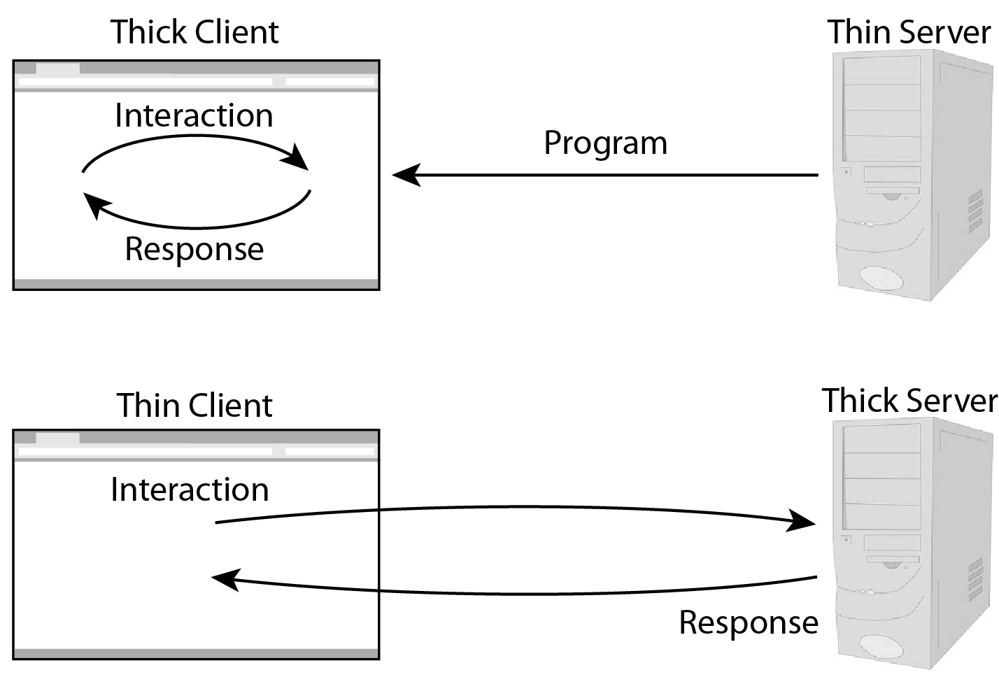
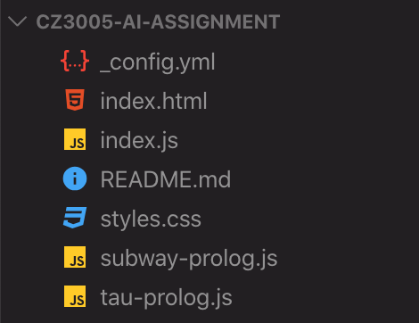
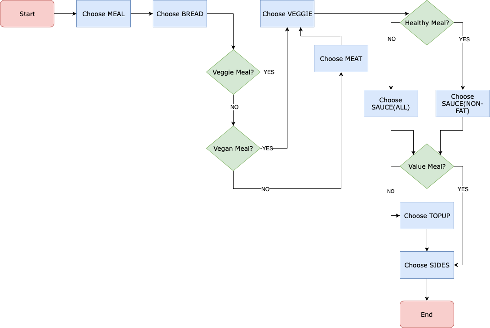

# CZ3005 Artificial Intelligence Assignment Documentation

# [Click Here To Go To Live DEMO page](http://okkarmin.github.io/CZ3005-AI-Assignment)

## Subway Sandwich Interactor

The prolog script offers different meal options, sandwich options, meat options, salad options, sauce options, top-up options, sides options etc. to create a customized list of person’s choice. The options should be intelligently selected based on previous choices. For example, if the person chose a veggie meal, meat options should not be offered. If a person chose healthy meal, fatty sauces should not be offered. If a person chose vegan meal, cheese top-up should not be offered. If a person chose value meal, no top-up should be offered.

## Demonstration Video (GUI)

<div align="center">
  <a href="https://www.youtube.com/watch?v=IymSPJiq6sw">
  
  </a>
</div>

## Demonstration Video (Console/Terminal)

- [ ] Insert Video Here

## System Architecture



'Fat Client' architecture.

When (1)User access the (2)Web Server through browser, (2) responds to (1) with index.html

Web Server is hosted on [github pages](https://pages.github.com).

[Tau Prolog](http://tau-prolog.org) for prolog logic querying/asserting with JavaScript.

## Directory Structure

<div align="center">
  
</div>

- \_config.yml → configuration file for github pages
- index.html → file served to user's browser when requested
- index.js → contians logic/functions to handle GUI interactions
- styles.css → styling of GUI components seen on index.html are defined
- subway-prolog.js → prolog logic in JavaScript file format. [Tau Prolog](http://tau-prolog.org) require the prolog logic to be in JavaScript file format.
- tau-prolog.js → an open source prolog interpreter in JavaScript

## Prolog Logic



1. Vegan and Veggies meals do not have meat options
2. Healthy meals do not have fatty sauces
3. Value meals do not have topup
4. Vegan meals do not have cheese topup

## Prolog Code Explanation (subway-prolog.pl & subway-prolog.js)

> Both (subway-prolog.pl & subway-prolog.js) contians the prolog logic.
>
> - subway-prolog.js is nothing but subway-prolog.pl converted to JavaScript literal string format

> Built-in predicate, [findall/3](https://www.swi-prolog.org/pldoc/man?predicate=findall/3) is used extensively.
>
> findall(X, pred(X), List) - Find possible values of X for given predicate and add to the List

First, implementation/setting up of methods that will be used for appending elements into a list

```prolog
append([], Y, Y).
append([H|X], Y, [H|Z]) :-
    append(X, Y, Z).
```

Next, following facts are defined to allow checking of true or false (condition)

```prolog
healthy_meal(healthy).
value_meal(value).
vegan_meal(vegan).
veggie_meal(veggie).
```

Possible choices of options for each category

```prolog
meals([healthy, normal, value, vegan, veggie]).
breads([wheat, honey_oat, italian, hearty_italian, flatbread]).
meats([chicken, beef, ham, bacon, salmon, tuna, turkey]).
veggies([cucumber, green_peppers, lettuce, red_onions, tomatoes]).
fatty_sauces([chipotle, bbq, ranch, sweet_chilli, mayo]).
non_fatty_sauces([honey_mustard, sweet_onion]).
cheese_topups([american, monterey_jack, cheddar]).
non_cheese_topups([avocado, egg_mayo]).
sides([chips, cookies, hashbrowns, drinks]).
```

Rules that would return a list. The result of the returned list depends on what has been asserted before.

Following code return a full list that corresponds to possible choices of actions

```prolog
ask_meals(X) :-
    meals(X).

ask_breads(X) :-
    breads(X).

ask_sides(X) :-
    sides(X).
```

#### 1. Vegan and Veggies meals do not have meat options

- Return an empty list if `assert(chosen_meals(vegan)).` or `assert(chosen_meals(veggie)).` has been done
- Otherwise, return a list that contains all the possible meat options

```prolog
ask_meats(X) :-
    findall(X,
            ( chosen_meals(Y),
              \+ vegan_meal(Y),
              \+ veggie_meal(Y),
              meats(X)
            ),
            X).
```

#### 2. Healthy meals do not have fatty sauces

- Return a list that contain only non_fatty_sauces if `assert(chosen_meals(healthy)).` has been done

- Otherwise, return a list that contians all the possible sauce options (fatty_sauces + non_fatty_sauces)

> Combining of the list is done using append method that was defined at the beginning

```prolog
ask_sauces(X) :-
    findall(X,
            (   chosen_meals(Y),
                healthy_meal(Y)
            ->  non_fatty_sauces(X)
            ;   fatty_sauces(L1),
                non_fatty_sauces(L2),
                append(L1, L2, X)
            ),
            X).
```

#### 3. Value meals do not have topup + 4. Vegan meals do not have cheese topup

- Return an empty list if `assert(chosen_meals(vegan)).` has been done
- Return a list that does not contain cheese_topups if `assert(chosen_meals(vegan)).` has been done
- Otherwise, return a list that contain all the possible top_up options (cheese_topups + non_cheese_topups)

```prolog
ask_topups(X) :-
    findall(X,
            (   chosen_meals(Y),
                \+ value_meal(Y)
            ->  (   vegan_meal(Y)
                ->  non_cheese_topups(X)
                ;   cheese_topups(L1),
                    non_cheese_topups(L2),
                    append(L1, L2, X)
                )
            ),
            X).
```

The following code return a list that contains corresponding user choice

```prolog
show_meals(Meals) :-
    findall(X, chosen_meals(X), Meals).
show_breads(Breads) :-
    findall(X, chosen_breads(X), Breads).
show_meats(Meats) :-
    findall(X, chosen_meats(X), Meats).
show_veggies(Veggies) :-
    findall(X, chosen_veggies(X), Veggies).
show_sauces(Sauces) :-
    findall(X, chosen_sauces(X), Sauces).
show_topups(TopUps) :-
    findall(X, chosen_topups(X), TopUps).
show_sides(Sides) :-
    findall(X, chosen_sides(X), Sides).
```
